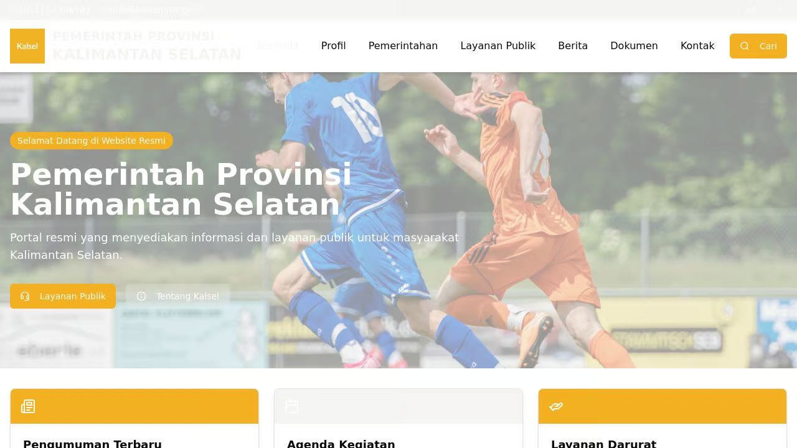

# South Kalimantan Government Website

A comprehensive local government website for South Kalimantan with news, services information, and document repository.

## Features

- Home page with latest news and services
- News section with categorized articles
- Government structure with officials profiles
- Public services information
- Document repository with search
- Contact page with form and map

## Technical Stack

- Frontend: React with TypeScript
- UI: TailwindCSS with ShadCN components
- Backend: Node.js with Express
- Data: In-memory storage
- Tools: Vite, Zod, React Query
